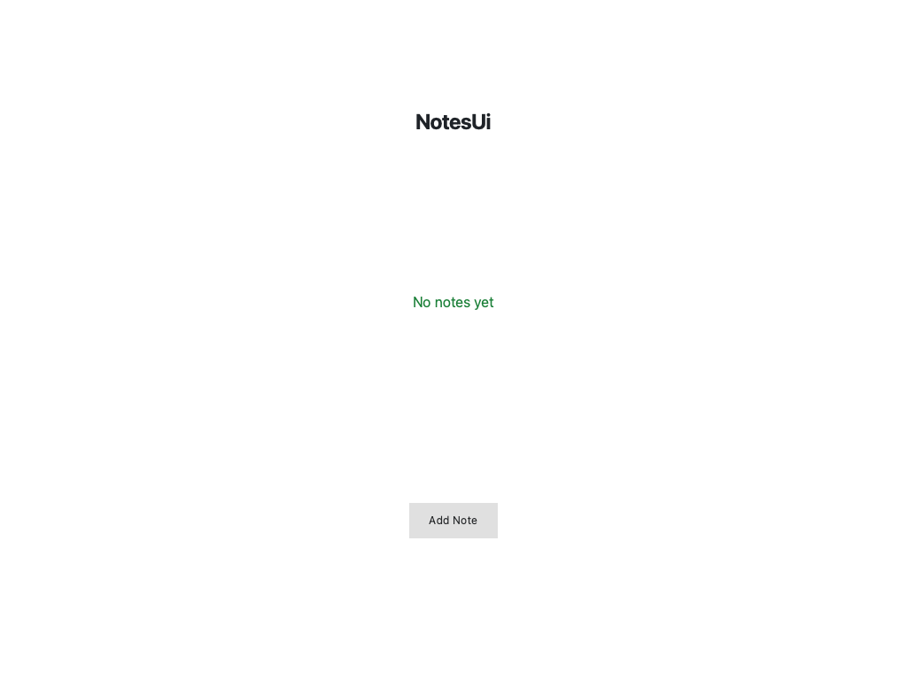
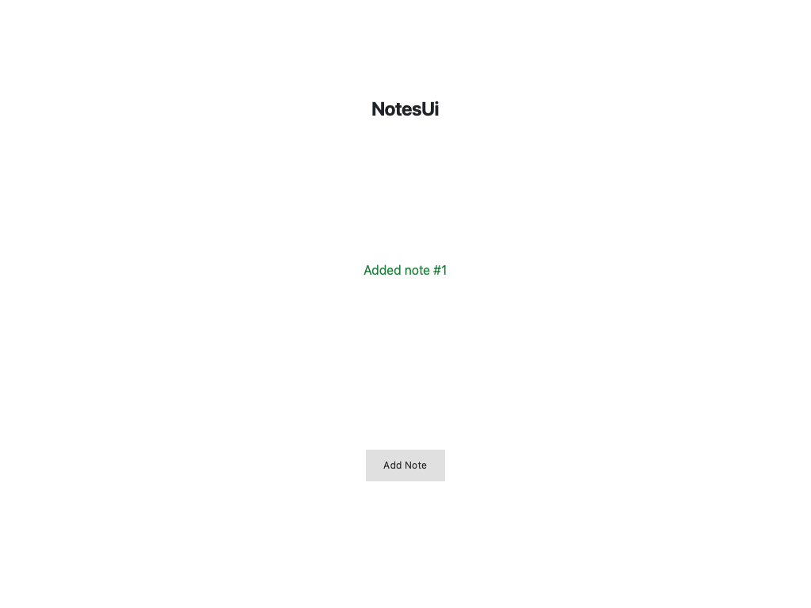

# Scaffolding a QML UI App with logos-dev-boost

Not every Logos component is a headless module — many are **UI apps** shown in
the Basecamp workspace. The simplest kind is a pure QML app: no C++, no
compilation, just a `Main.qml` that the host renders and that talks to backend
modules through the injected `logos` bridge. `logos-dev-boost` scaffolds one
with a single command.

This doc-test exercises **this** dev-boost commit end-to-end on that workflow:

1. Scaffold a `notes_ui` app with `init notes_ui --type ui-qml` — built from the
   commit under test, not the latest published flake.
2. Give its button something visible to do — a tiny "Add Note" counter, so the
   UI has a state change we can drive and confirm.
3. Build it. Because the UI is built with
   [`logos-app-builder`](https://github.com/logos-co/logos-app-builder) via
   `mkLogosQmlModule`, its flake exposes a standalone app (`apps.default`) that
   `nix run` launches in its own window.
4. **Launch the app headlessly** (`QT_QPA_PLATFORM=offscreen`) and drive it
   through its QML inspector with
   [`logos-qt-mcp`](https://github.com/logos-co/logos-qt-mcp): wait for the UI,
   screenshot the initial state, **click the button**, confirm the on-screen
   text changes in response, and screenshot the result. The screenshots are
   embedded in the rendered tutorial and the CI report.

A green run is real evidence that `init --type ui-qml` still produces a UI app
that builds, renders, and responds to interaction.

**What you'll build:** The `notes_ui` standalone QML app, scaffolded by this dev-boost commit and driven headlessly through its QML UI — clicking a button and confirming the UI responds.

**What you'll learn:**

- How `init --type ui-qml` scaffolds a pure QML Basecamp app
- How a UI built with logos-app-builder exposes a standalone `nix run` app
- How to drive a headless Qt/QML app with logos-qt-mcp (wait, click, assert, screenshot)
- How to confirm a UI interaction by asserting on the resulting on-screen change

## Prerequisites

- **Nix** with flakes enabled. Install from [nixos.org](https://nixos.org/download.html), then enable flakes:

```bash
mkdir -p ~/.config/nix
echo 'experimental-features = nix-command flakes' >> ~/.config/nix/nix.conf
```

Verify: `nix flake --help >/dev/null 2>&1 && echo "Flakes enabled"`

- **git** — the scaffolded project is a flake, and Nix only sees git-tracked files.
- **A Linux or macOS machine.** The app runs headless via `QT_QPA_PLATFORM=offscreen`, so no display is required.

---

## Step 1: Scaffold the UI app

Run `init` with `--type ui-qml`. This is the pure-QML app type: a single
`Main.qml` rendered by the host, no C++ to compile. The command creates a
`logos-notes-ui/` directory with the QML view, `metadata.json`, a
`flake.nix`, and AI context files.

> `` pins dev-boost to the commit under test: the runner expands it
> to this checkout's `HEAD` locally (see `run.sh`), or the PR commit in CI.
> With no pin it falls back to the latest published `master`.

### 1.1 Run init

```bash
nix run github:logos-co/logos-dev-boost -- init notes_ui --type ui-qml
```

The scaffold lays out a complete, runnable QML app:

```
logos-notes-ui/
├── Main.qml                    # The QML view — your UI
├── metadata.json               # type: ui_qml, view: Main.qml
├── flake.nix                   # mkLogosQmlModule (standalone app)
├── AGENTS.md / CLAUDE.md       # AI context
└── .mcp.json / .claude/skills/ # MCP server + on-demand skills
```

### 1.2 Inspect the QML view

The scaffold's `Main.qml` shows a title, a subtitle, and a button wired
to call a backend module via the `logos` bridge (commented out until you
add a dependency). It uses no C++ — the host renders it directly.

```bash
cat logos-notes-ui/Main.qml
```

`metadata.json` declares `"type": "ui_qml"` and `"view": "Main.qml"` —
that is what tells the host to render this as a UI app rather than load
it as a headless module.

---

## Step 2: Make the button do something

The template button only logs to the console. To have a UI response we can
actually see and confirm, replace `Main.qml` with a tiny **"Add Note"
counter**: a status line that reads `No notes yet`, and a button that
increments a count and updates the status to `Added note #N`. This is still
pure QML — no backend, no C++.

### 2.1 Replace Main.qml with an interactive counter

```qml
import QtQuick 2.15
import QtQuick.Controls 2.15
import QtQuick.Layouts 1.15

Item {
    id: root
    width: 400
    height: 300

    // The piece of state the button changes.
    property int count: 0

    ColumnLayout {
        anchors.fill: parent
        anchors.margins: 24
        spacing: 16

        Text {
            Layout.alignment: Qt.AlignHCenter
            text: "NotesUi"
            font.pixelSize: 24
            font.bold: true
            color: "#1f2328"
        }

        // Reacts to `count`: the visible proof a click did something.
        Text {
            Layout.alignment: Qt.AlignHCenter
            text: root.count === 0
                ? "No notes yet"
                : "Added note #" + root.count
            font.pixelSize: 16
            color: "#1a7f37"
        }

        Button {
            Layout.alignment: Qt.AlignHCenter
            text: "Add Note"
            onClicked: root.count += 1
        }
    }
}
```

The status `Text` binds to `count`, so each click of **Add Note**
re-renders it from `No notes yet` to `Added note #1`, `#2`, and so on —
a state change the headless test can drive and assert on.

---

## Step 3: Build the app

`nix build` packages the QML app. `mkLogosQmlModule` stages the QML and
metadata into a plugin and wires up `apps.default`, so the flake exposes a
standalone app that `nix run` launches in its own window. Nix only sees
git-tracked files, so we `git init` and stage everything first.

### 3.1 Init git, stage, and build

```bash
cd logos-notes-ui
git init && git add -A
nix build
```

The build produces a `result` with the staged QML plugin and the
standalone app entry point.

---

## Step 4: Launch the app, click the button, and verify the response

Launch the standalone app with `nix run` and drive it headlessly through its
QML inspector. The doc-test builds [`logos-qt-mcp`](https://github.com/logos-co/logos-qt-mcp)
(the harness that connects to the inspector), waits for the UI, screenshots
the initial state, **clicks the Add Note button**, confirms the status text
changes to `Added note #1`, and screenshots the result.

> The app is launched with `QT_QPA_PLATFORM=offscreen`, so it runs without a
> display — the same way it runs in CI.

### 4.1 Launch and drive the app

```bash
nix run ./logos-notes-ui
```

The app on launch: the status line reads **No notes yet**, with an
**Add Note** button below it.



After one click of **Add Note**, the status line has re-rendered to
**Added note #1** — the UI responded to the interaction.



This is a real interaction driven headlessly: the test reads the initial
on-screen text (`No notes yet`), clicks the **Add Note** button by its
label, and then asserts the status line re-rendered to `Added note #1`.
Because the wait would time out if the click had no effect, a green run
proves the scaffolded app builds, renders, and responds to input. Both
screenshots are embedded above and in the CI report.
